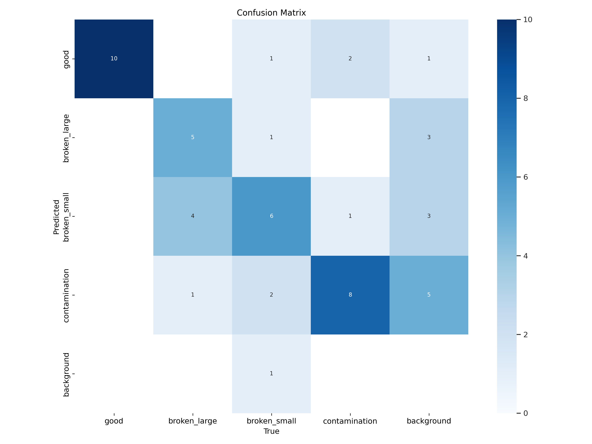
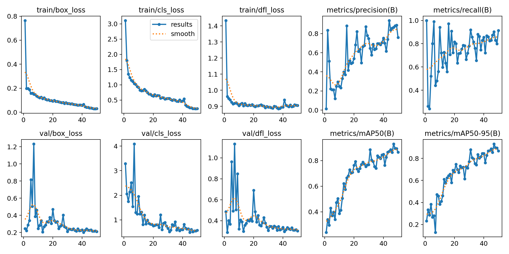
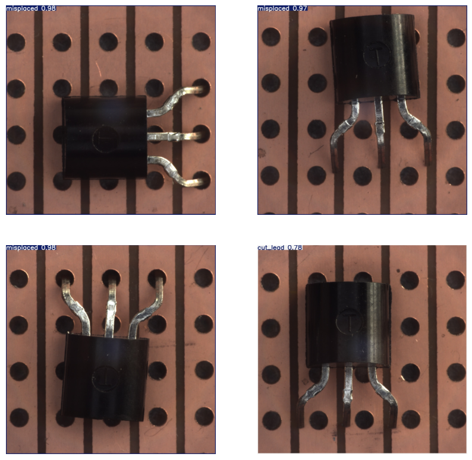
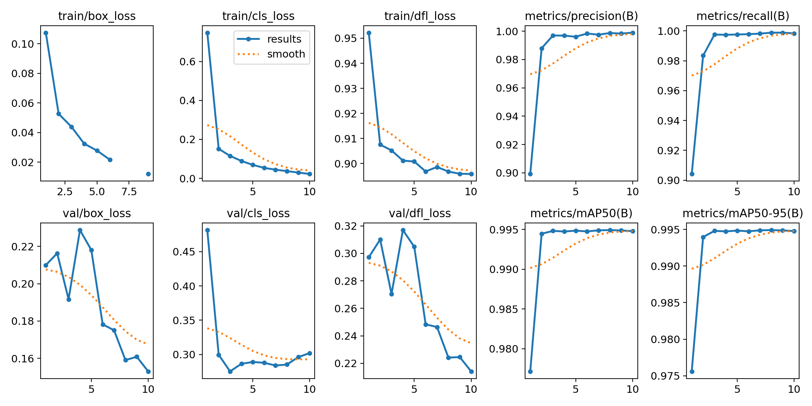
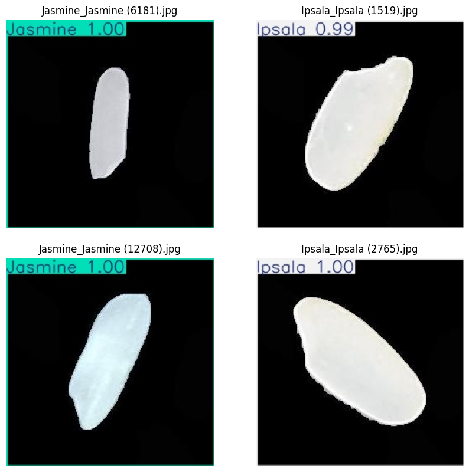
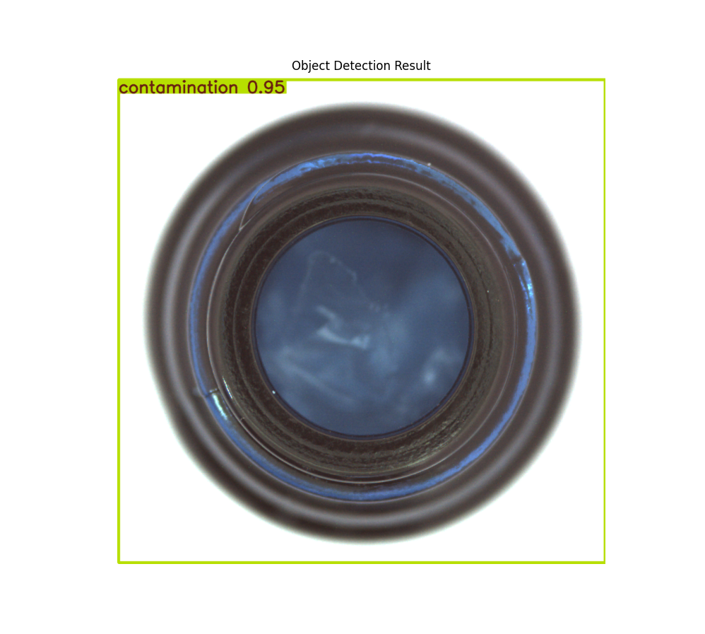

# Ultralytics YOLO for classification

**Objectives**

1. **Investigate the applicability of the MVTec AD dataset for training and predicting bottle classification.**
2. **Explore the use of the MVTec AD dataset for training and predicting transistor classification.**
3. **Develop a continuous training workflow that enables the export and import of intermediate training data, avoiding the need to restart training from the beginning.**
4. **Identify and optimize hyperparameters and algorithms to achieve high accuracy (95%+) while maintaining a low classification loss (10% or lower).** 


# Pre-trained YOLO models we use
## YOLOv11 Model Comparison Table

| Feature                 | yolo11n.pt                 | yolo11s.pt                 | yolo11m.pt                 |
|--------------------------|----------------------------|----------------------------|----------------------------|
| **Input Resolution**      | 416x416                    | 416x416                    | 416x416                    |
| **Parameters (Approx.)**  | 6.8 M                      | 15.7 M                     | 53.0 M                     |
| **FLOPs (Approx.)**       | 4.5 TFLOPS                 | 9.9 TFLOPS                 | 31.9 TFLOPS                 |
| **Speed (FPS - RTX 3080)** | High (100+)                 | Medium (50-100)             | Low (10-50)                 |
| **Accuracy (mAP)**        | Lower                      | Moderate                    | Higher                      |
| **Target Hardware**       | Mobile/Embedded Devices    | GPUs with Limited Memory    | High-Performance GPUs       |


* **Input Resolution:** All three models use the same input resolution of 416x416 pixels.
* **Parameters:** The number of parameters in the model directly affects its size and complexity. YOLOv11n.pt has the fewest parameters, making it suitable for mobile or embedded devices. YOLOv11m.pt has the most parameters, leading to higher accuracy but requiring more powerful hardware.
* **FLOPs:** FLOPs (Floating-point Operations) represent the computational complexity of the model. YOLOv11n.pt has the lowest FLOPs, allowing for faster inference on devices with limited processing power.
* **Speed:** Speed is measured in frames per second (FPS). YOLOv11n.pt is generally the fastest due to its lower complexity. YOLOv11m.pt is the slowest but offers the highest accuracy.
* **Accuracy:** Mean Average Precision (mAP) is a metric used to measure object detection accuracy. YOLOv11m.pt typically achieves the highest mAP due to its increased complexity. However, the difference in accuracy might be negligible for some applications.
* **Target Hardware:**  YOLOv11n.pt is well-suited for resource-constrained environments like mobile devices. YOLOv11s.pt offers a balance between speed and accuracy for GPUs with limited memory. YOLOv11m.pt is ideal for high-performance GPUs where maximizing accuracy is the priority.


# Configurations

**DEFAULT_PARAMS**
```py
DEFAULT_PARAMS = dict(
    model_names     = ["yolo11n.pt", 'yolo11s.pt', 'yolo11m.pt'],
    imgsizes        = [256, 512],
    optimizers      = ["SGD", "AdamW", "Adam"],
    learning_rates  = [0.01, 0.005, 0.001],
    batch_size      = 16, # Adjust this if OOM
    epochs          = 50,
    image_augments  = [False, True]
)
```

**Bottle classes**
```py
class_map = dict(
    good          = 0,
    broken_large  = 1,
    broken_small  = 2,
    contamination = 3
)
```
**Transistor classes**
```py
class_map = dict(
    good          = 0,
    bent_lead     = 1,
    cut_lead      = 2,
    damaged_case  = 3,
    misplaced     = 4
)
```

**Rice classes**
```py
class_map = dict(
    Arborio   = 0,
    Basmati   = 1,
    Ipsala    = 2,
    Jasmine   = 3,
    Karacadag = 4
)
```


# Example: model performance

## Bottle
**confusion_matrix**


**training_results**


**prediction**


## Transistor
**confusion_matrix**


**training_results**


**prediction**



## Rice
**confusion_matrix**


**training_results**


**prediction**



# Current Cross-model-parameter training results
**metrics/mAP50**


**val/cls_loss**


# Prediction

***The best mAP50 accuracy is***
<small>-> Try model here [best.pt](./models/bottle/Run8_yolo11n_512_SGD_Aug/best.pt)</small>

```yaml
- run8: Run8_yolo11n_512_SGD_Aug
- accuracy: 0.98 mAP50
- loss: 0.58 cls_loss
- imgsz: 512
- optimizer: SGD
- epoch: 50/50
- lr: 0.01
- image augmentation: True
- yolo-model: yollo11n.pt
```


***The lowest val/cls_loss is*** -> Try model here [best.pt](./models/bottle/Run7_yolo11n_512_SGD/best.pt)
```yaml
- run7: Run7_yolo11n_512_SGD
- accuracy: 0.95 mAP50
- loss: 0.26 cls_loss
- imgsz: 512
- optimizer: SGD
- epoch: 44/50
- lr: 0.01
- image augmented: False
- yolo-model: yollo11n.pt
```


# Manual Testing

**bash command example**

`Note`: please specifiy desired model path as the 1st argument and following by one or more testing image paths as  the rest arguments.

```sh
$ python bottle_console_app.py \
  models/bottle/Run7_yolo11n_512_SGD/best.pt \
  tests/bottle_input.png
```

**Output**
```sh
Processing image: tests/bottle_input.png

image 1/1 ./tests/bottle_input.png: 512x512 1 contamination, 66.8ms
Speed: 3.0ms preprocess, 66.8ms inference, 1.0ms postprocess per image at shape (1, 3, 512, 512)
Result:
Object 1:
  Type:  3, Confidence: 0.95
  Coordinates: x_min=0.003, y_min=0.008, x_max=0.999, y_max=0.997
  Dimensions: width=0.996, height=0.989, Area=0.986

Saved predicted result to ./output/bottle_input.png
```

**Figure**



# Conclusion
> Experiments suggest that utilizing the `YOLOv11n` model with a `512`-pixel image size and the `SGD` learning algorithm can yield improved results. Furthermore, employing image augmentation techniques such as rotation, flipping, grayscale conversion, and brightness adjustment can further enhance accuracy.

> While the goal of achieving `95%` `mAP50` was partially met, certain parameter combinations demonstrated promising results:
> - Run8_`yolo11n_512_SGD_Aug` (`0.98` `mAP50`)
> - Run7_yolo11n_512_SGD (0.96 mAP50)
> - Run32_yolo11m_512_SGD_Aug (0.96 mAP50)

> However, the goal of minimizing the loss value was not achieved. In every run, the loss value exceeded the target threshold by at least 20%. The top 3 runs with the lowest loss values were:
> - Run7_`yolo11n_512_SGD` (`0.26` `val/cls_loss`)
> - Run14_yolo11s_256_SGD_Aug (0.37 val/cls_loss)
> - Run32_yolo11m_512_SGD_Aug (0.40 val/cls_loss)"


# References
- [Ultralytics YOLO Docs](https://docs.ultralytics.com/)
- [Ultralytics Github](https://github.com/ultralytics/ultralytics)
- [MVTecAD (MVTec Anomaly Detection)](https://www.kaggle.com/datasets/thtuan/mvtecad-mvtec-anomaly-detection)
- [Rice Image Dataset for Object Detection](https://www.kaggle.com/datasets/alikhalilit98/rice-image-dataset-for-object-detection)
